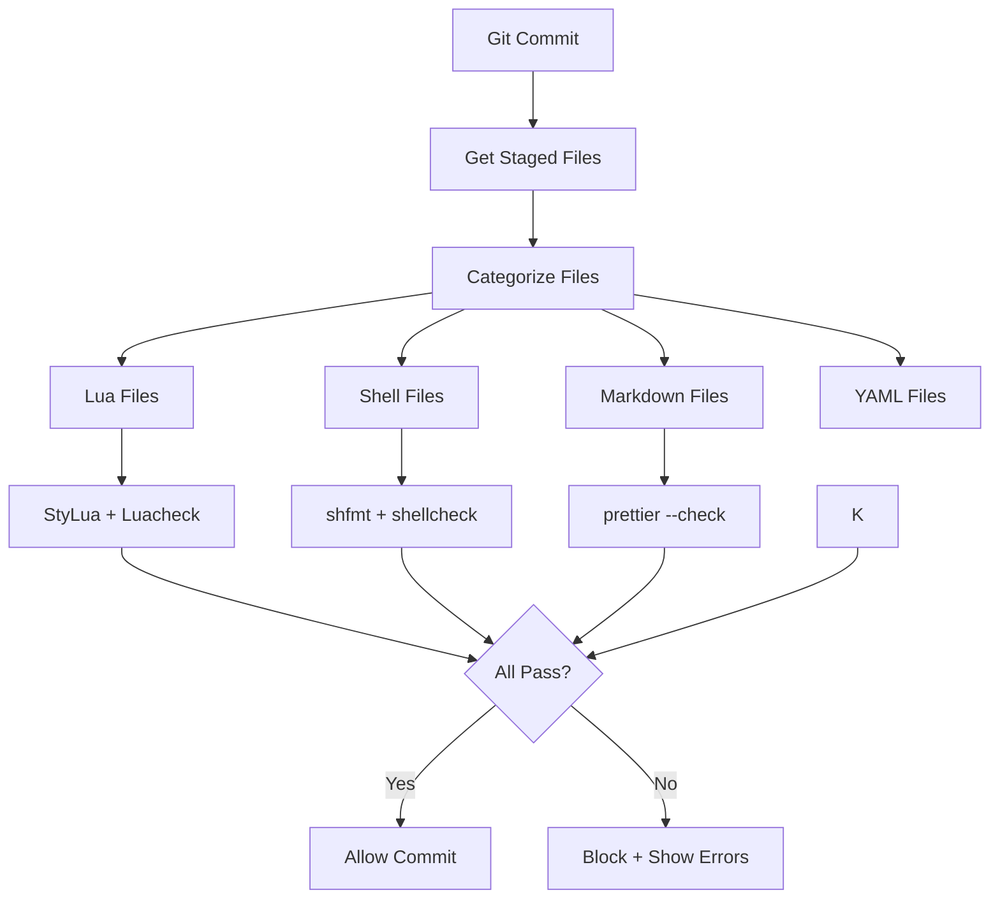

# Design Document

## Feature: Enhanced Commit Hook System

## Overview

This design extends the existing `/scripts/install-hooks` system by adding support for additional file types (Markdown, YAML/JSON) and shellcheck for shell scripts. The approach follows the existing proven patterns without adding complexity.

## Code Reuse Analysis

### Existing Components to Leverage

- **File Detection**: `git diff --cached --name-only --diff-filter=ACM` for staged files
- **File Categorization**: Pattern matching for `.lua`, `.sh`, and `scripts/*` files
- **Tool Checking**: `command -v tool` with graceful degradation and installation guidance
- **Colored Output**: Red/green/yellow messaging system
- **Error Handling**: Clear messages with actionable fix suggestions

### Simple Extensions Needed

- **Add shellcheck** to existing shell file processing
- **Add markdown_files array** and prettier formatting
- **Follow existing patterns** for tool availability and error reporting

## Architecture

### Enhanced File Processing Flow



## Component Extensions

### 1. Enhanced File Categorization

**Extends existing pattern matching in install-hooks:**

```bash
# Existing
lua_files=()
shell_files=()

# Add these
markdown_files=()

# In file categorization loop
*.md) markdown_files+=("$file") ;;
```

### 2. Shell File Enhancement

**Add shellcheck to existing shfmt processing:**

```bash
process_shell_files() {
  # Existing shfmt logic
  if command -v shfmt > /dev/null 2>&1; then
    # existing shfmt checks
  fi

  # Add shellcheck
  if command -v shellcheck > /dev/null 2>&1; then
    for file in "${shell_files[@]}"; do
      if ! shellcheck "$file"; then
        echo -e "${RED}shellcheck failed for $file${NC}"
        failed=1
      fi
    done
  else
    echo -e "${YELLOW}shellcheck not found. Install with: sudo apt install shellcheck${NC}"
  fi
}
```

### 3. Markdown Processing

**Add prettier formatting for markdown files:**

```bash
process_markdown_files() {
  if [[ ${#markdown_files[@]} -eq 0 ]]; then
    return 0
  fi

  if command -v prettier > /dev/null 2>&1; then
    echo "Checking markdown formatting..."
    for file in "${markdown_files[@]}"; do
      if ! prettier --check "$file" > /dev/null 2>&1; then
        echo -e "${RED}Markdown formatting issues in $file${NC}"
        echo -e "${YELLOW}Run: prettier --write $file${NC}"
        failed=1
      fi
    done
  else
    echo -e "${YELLOW}prettier not found. Install with: npm install -g prettier${NC}"
  fi
}
```

## Integration Points

### Makefile Extensions

**Add new targets following existing patterns:**

```makefile
# Extend existing targets
format-check:
	# existing stylua/shfmt checks
	@prettier --check *.md || true

lint:
	# existing luacheck
	@shellcheck scripts/* || true
```

### GitHub Actions

**Extend existing workflow jobs:**

```yaml
format:
  # existing stylua/shfmt steps
  - name: Check markdown formatting
    run: prettier --check "**/*.md"
```

## Implementation Strategy

### Simple Enhancement Approach

1. **Extend `/scripts/install-hooks`** with new file type arrays
2. **Add processing functions** following existing patterns
3. **Update Makefile targets** to include new tools
4. **Extend GitHub Actions** with new validation steps
5. **Test with existing test framework**

### Tool Installation Guidance

**Follow existing patterns for missing tools:**

- **prettier**: `npm install -g prettier`
- **shellcheck**: `sudo apt install shellcheck` (most distros)

## Backward Compatibility

**Zero Breaking Changes:**

- All existing functionality preserved exactly
- New tools are optional with graceful degradation
- Same installation process: `make install-hooks`
- Same colored output and error message patterns
