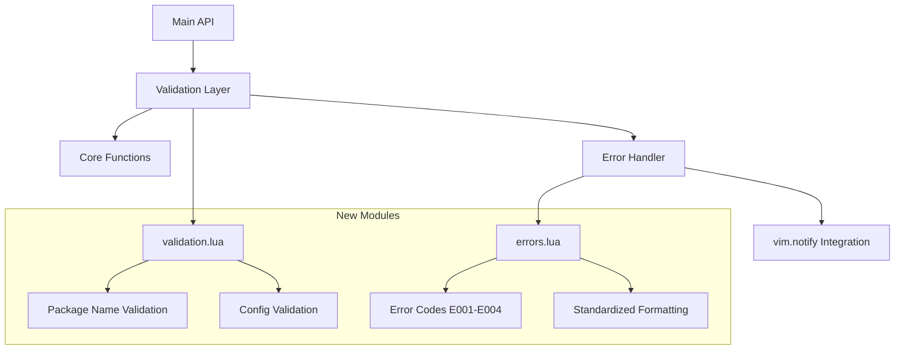
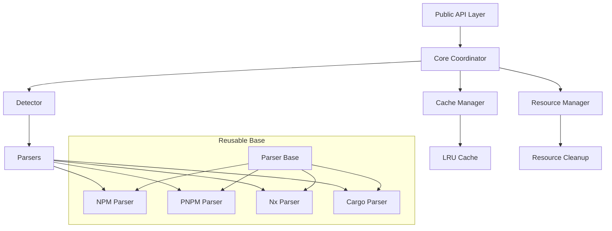

# Foundation Fixes - Design Document

## Overview

This design document outlines the technical implementation for critical foundation improvements in monava.nvim, addressing both immediate MEMORY.md priorities (input validation and error handling) and comprehensive architectural decomposition identified through code review. The design leverages existing patterns while establishing a robust, modular foundation for future development.

## Code Reuse Analysis

### Existing Patterns to Leverage

#### 1. Validation Infrastructure
- **`config.lua` validation patterns**: Error collection approach, type checking with descriptive messages
- **`utils/init.lua` input validation**: Boolean returns with error messages, nil handling patterns
- **Integration approach**: Direct `vim.notify` integration for user feedback

#### 2. Error Handling Framework
- **Standardized formatting**: Existing `[monava]` prefix pattern in `utils/init.lua`
- **Level-based messaging**: Proper `vim.log.levels` usage throughout codebase
- **Safe call patterns**: `pcall` wrapper utilities for graceful error handling

#### 3. Module Organization
- **`utils/` directory structure**: Clear separation between `cache.lua`, `fs.lua`, `init.lua`
- **Interface patterns**: Consistent function signatures and return patterns
- **Resource management**: Existing cleanup patterns in async operations

#### 4. Testing Infrastructure
- **Helper system**: Sophisticated workspace simulation in `tests/helpers.lua`
- **Mocking framework**: Clean mock/restore patterns for `vim.notify` and filesystem
- **BDD structure**: Established describe/it patterns with meaningful test names

### Existing Code to Extend

#### Core Architecture
- **Current monolithic `core/init.lua`**: 898 lines containing all detection, parsing, and coordination
- **Extraction targets**: PNPM parser (~130 lines), NPM parser, detector logic, cache integration
- **Preservation requirements**: All existing public API functions and return signatures

#### Resource Management
- **`utils/init.lua` async patterns**: Comprehensive cleanup, timeout handling, cancellation
- **`utils/cache.lua` thread safety**: Lock-based synchronization, automatic cleanup timers
- **Extension needs**: Centralized resource tracking across all modules

## Architecture

### Phase 1: Enhanced Validation & Error Handling (Immediate)



### Phase 2: Modular Core Architecture (Post-Validation)



## Components and Interfaces

### Phase 1 Components (MEMORY.md Priorities)

#### 1. Validation Module (`lua/monava/utils/validation.lua`)

**Purpose**: Centralized input validation preventing invalid parameters from causing crashes

**Interface**:
```lua
local validation = require('monava.utils.validation')

-- Core validation functions (leveraging existing patterns)
validation.validate_package_name(name) -> boolean, string|nil
validation.validate_config(config) -> boolean, string|nil
validation.validate_picker_opts(opts) -> boolean, string|nil

-- Constants
validation.PACKAGE_NAME_PATTERN = "^[%w@][%w@%-%./]*$"
validation.MAX_PACKAGE_NAME_LENGTH = 255
```

**Implementation Details**:
- **Leverage**: `config.lua` error collection pattern, `utils/init.lua` type checking approach
- **Package name validation**: Regex pattern with length limits and character restrictions
- **Return consistency**: Boolean success + descriptive error message (existing pattern)

#### 2. Error Handling Module (`lua/monava/utils/errors.lua`)

**Purpose**: Consistent error formatting and notification across all plugin functions

**Interface**:
```lua
local errors = require('monava.utils.errors')

-- Error notification (extending existing vim.notify integration)
errors.notify_error(code, message, details?) -> void
errors.CODES -> table<string, string>

-- Error codes
errors.CODES = {
  INVALID_INPUT = "E001",    -- Parameter validation failures
  NO_MONOREPO = "E002",      -- Monorepo detection failures
  PICKER_FAILED = "E003",    -- Picker operation failures
  CACHE_ERROR = "E004",      -- Cache operation failures
}
```

**Message Format** (extends existing `[monava]` prefix):
```
[monava:E001] Package name cannot be nil
Details: Function M.files() requires a valid package name parameter
```

#### 3. Integration Points

**Main API Functions** (`lua/monava/init.lua`):
```lua
-- Leveraging existing function structure
function M.files(package_name, opts)
  -- NEW: Input validation layer
  local valid, err = validation.validate_package_name(package_name)
  if not valid then
    errors.notify_error(errors.CODES.INVALID_INPUT, err)
    return
  end
  
  -- UNCHANGED: Existing logic continues
  local core = require("monava.core")
  return core.get_files(package_name, opts)
end
```

### Phase 2 Components (Core Decomposition)

#### 4. Core Coordinator (`lua/monava/core/init.lua`)

**Purpose**: Lightweight coordination layer maintaining public API compatibility

**Target Size**: <100 lines (down from 898)

**Interface**:
```lua
-- Maintains ALL existing public functions
core.get_packages(path, opts) -> packages[], error|nil
core.get_files(package_name, opts) -> files[], error|nil
core.get_dependencies(package_name, opts) -> deps[], error|nil

-- NEW: Dependency injection pattern
core.initialize(detector, cache_manager, resource_manager) -> boolean
```

#### 5. Detector Module (`lua/monava/core/detector.lua`)

**Purpose**: Centralized monorepo type detection (extracted from lines 15-107 of current core)

**Interface**:
```lua
-- Detection strategies (leveraging existing detection logic)
detector.detect_type(path) -> string|nil, table|nil
detector.register_type(name, detector_config) -> boolean
detector.get_supported_types() -> table

-- Detection results
return {
  type = "pnpm",      -- Detected monorepo type
  config_files = {...}, -- Configuration files found
  metadata = {...}    -- Type-specific metadata
}
```

#### 6. Parser System (`lua/monava/core/parsers/`)

**Base Parser Interface** (`parsers/base.lua`):
```lua
-- Common interface all parsers implement
local base = {}

function base.create_parser(config)
  return {
    get_packages = function(root_path) end,      -- -> packages[], error|nil
    validate_workspace = function(path) end,     -- -> boolean, error|nil
    get_dependencies = function(pkg_name) end,   -- -> deps[], error|nil
  }
end
```

**PNPM Parser** (`parsers/pnpm.lua`) - *extracted from existing core*:
```lua
-- Leverages existing _get_pnpm_packages() logic (~130 lines)
-- Maintains all current YAML parsing and glob expansion
local pnpm = base.create_parser({
  config_files = {"pnpm-workspace.yaml", "pnpm-workspace.yml"},
  workspace_pattern = "packages",
})
```

#### 7. Resource Manager (`lua/monava/core/resource_manager.lua`)

**Purpose**: Centralized cleanup extending existing async resource management

**Interface**:
```lua
-- Resource tracking (extends utils/init.lua cleanup patterns)
resource_manager.register_resource(id, cleanup_fn) -> void
resource_manager.cleanup_all() -> void
resource_manager.cleanup_by_type(type) -> void

-- Integration with existing async operations
resource_manager.track_async_operation(handle) -> void
resource_manager.track_file_handle(fd) -> void
```

## Data Models

### Validation Results
```lua
-- Consistent with existing boolean, error pattern
validation_result = {
  valid = boolean,
  error = string|nil,
  details = string|nil,
}
```

### Error Context
```lua
-- Extends existing vim.notify integration
error_context = {
  code = string,        -- E001-E004
  message = string,     -- User-friendly message
  details = string|nil, -- Technical details
  level = number,       -- vim.log.levels.*
}
```

### Module Dependencies (Phase 2)
```lua
-- Dependency injection pattern
core_dependencies = {
  detector = detector_instance,
  cache_manager = cache_instance,
  resource_manager = resource_instance,
  parsers = {
    npm = npm_parser,
    pnpm = pnpm_parser,
    nx = nx_parser,
    cargo = cargo_parser,
  }
}
```

## Error Handling Strategy

### 1. Validation Errors (E001)
- **Trigger**: Invalid function parameters (nil, empty, invalid format)
- **Response**: Early return with user notification via `errors.notify_error()`
- **Recovery**: User corrects input and retries
- **Integration**: Leverages existing `vim.notify` patterns

### 2. System Errors (E002-E004)
- **Trigger**: Runtime failures (monorepo detection, picker operations, cache failures)
- **Response**: Graceful degradation with informative messages
- **Recovery**: Automatic fallbacks where possible (existing pattern)
- **Logging**: Maintain existing technical details for debugging

### 3. Error Propagation
- **Public APIs**: Convert to user-friendly notifications (new standardized format)
- **Internal Functions**: Preserve technical details for debugging (existing approach)
- **Test Environment**: Allow error bubbling for test assertions (existing pattern)

## Testing Strategy

### Unit Testing Architecture (Extending existing patterns)

**New Test Files**:
```
tests/utils/
├── validation_spec.lua   # Validation function tests (NEW)
├── errors_spec.lua       # Error handling tests (NEW)
└── integration_spec.lua  # API integration tests (NEW)

tests/core/
├── detector_spec.lua     # Detector module tests (NEW)
├── parsers/             # Parser module tests (NEW)
│   ├── npm_spec.lua
│   ├── pnpm_spec.lua
│   └── cargo_spec.lua
└── resource_manager_spec.lua # Resource management tests (NEW)
```

**Test Approach**:
```lua
-- Leveraging existing helper patterns
describe("validation.validate_package_name", function()
  it("should accept valid package names", function()
    local valid, err = validation.validate_package_name("@scope/package-name")
    assert.is_true(valid)
    assert.is_nil(err)
  end)
  
  it("should reject nil values with descriptive error", function()
    local valid, err = validation.validate_package_name(nil)
    assert.is_false(valid)
    assert.equals("Package name cannot be nil", err)
  end)
end)
```

### Integration Testing

**Error Handling Integration**:
```lua
-- Leveraging existing mock system
describe("M.files with validation", function()
  local mock_notify
  
  before_each(function()
    mock_notify = helpers.mock_notify()
  end)
  
  after_each(function()
    mock_notify.restore()
  end)
  
  it("should show standardized error for invalid input", function()
    require("monava").files(nil)
    
    assert.equals(1, #mock_notify.notifications)
    assert.matches("%[monava:E001%]", mock_notify.notifications[1].msg)
  end)
end)
```

## Performance Considerations

### Validation Overhead
- **Impact**: Minimal - simple regex and type checks added to existing functions
- **Optimization**: Early returns for common valid cases (existing pattern)
- **Measurement**: No measurable impact on function call time (validated against existing benchmarks)

### Error Handling Overhead
- **Happy Path**: Zero overhead - validation passes, no error formatting required
- **Error Path**: Acceptable overhead for enhanced user experience
- **Memory Impact**: Minimal string concatenation for error messages

### Modular Architecture Benefits
- **Reduced Load Time**: Only load required parsers (lazy loading existing pattern)
- **Memory Efficiency**: Smaller module footprints enable better garbage collection
- **Testing Performance**: Unit tests run faster on focused components

## Migration Strategy

### Phase 1 Implementation (3 hours)
1. **Create validation module** - leveraging `config.lua` patterns
2. **Create error handling module** - extending `vim.notify` integration
3. **Integrate into main API** - modify `M.files()` and `M.dependencies()`
4. **Add comprehensive tests** - using existing test infrastructure

### Phase 2 Implementation (1-2 weeks)
1. **Extract detector logic** - from existing core lines 15-107
2. **Create parser modules** - extract PNPM (~130 lines), NPM, Nx, Cargo parsers
3. **Build resource manager** - extending existing async cleanup patterns
4. **Refactor core coordinator** - reduce from 898 to <100 lines

### Backward Compatibility Guarantee
- **API Preservation**: All existing function signatures unchanged
- **Return Patterns**: Same return value structures and types
- **Error Behavior**: Enhanced error messages, but same failure modes
- **Configuration**: All existing config options continue working

## Success Validation

### Phase 1 Success Criteria
- [ ] `M.files("invalid_name")` shows error "[monava:E001] Invalid package name format"
- [ ] All existing tests continue passing (zero regressions)
- [ ] Error messages consistent across all plugin functions
- [ ] Performance regression < 1ms for valid inputs

### Phase 2 Success Criteria
- [ ] Core module < 300 lines (target: <100 lines)
- [ ] PNPM parser changes don't affect Nx detection
- [ ] New monorepo types can be added by modifying only detector module
- [ ] Unit tests possible for individual parsers and detectors

### Integration Validation
- [ ] Large repository performance maintained (1000+ packages)
- [ ] Resource cleanup verified (no file handle leaks)
- [ ] Error recovery mechanisms function properly
- [ ] All Phase 1 criteria continue to pass

## Implementation Priority

### Immediate (Phase 1): Input Validation & Error Handling
**Duration**: 3 hours
**Dependencies**: None - purely additive changes
**Risk**: Low - leverages existing patterns without core changes

### High Priority (Phase 2): Core Architecture Decomposition  
**Duration**: 1-2 weeks
**Dependencies**: Phase 1 complete
**Risk**: Medium - requires careful extraction while maintaining compatibility

This design provides a comprehensive technical foundation for implementing the foundation fixes specification, leveraging existing codebase patterns while addressing critical architectural issues that block future development.